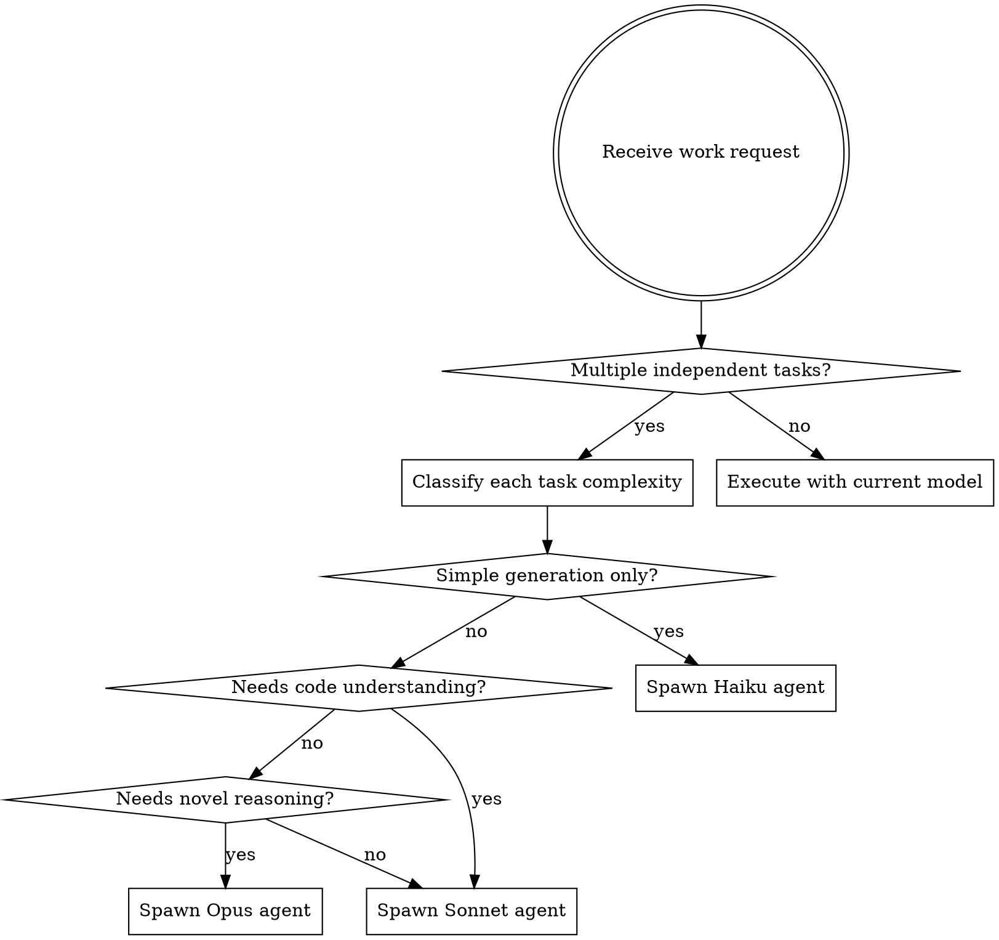

# Token-Optimized Research

## Overview

**Core principle:** Match model capability to task complexity. Using Sonnet for simple tasks wastes 5-10x tokens. Using Haiku for complex analysis produces poor results.

**Token reality:** Simple text generation (Jira tickets, test data, commit messages) costs ~5K tokens on Haiku vs ~30K on Sonnet. Complex code analysis requires Sonnet's reasoning capability.

## When to Use

Use this skill when:

- Spawning multiple agents for independent tasks
- Executing mixed workloads (simple + complex tasks)
- Planning research that will create multiple subagents
- **Multi-step sequential work** (review → create tickets, explore → document)
- Token/cost efficiency matters for your work

Don't use when:

- Single task already in progress (switching mid-task is inefficient)
- Task complexity unclear (default to Sonnet, optimize later)

## When NOT to Skip Optimization

**Common rationalizations for skipping token optimization:**

| Excuse                              | Reality                                                                                                           | Fix                                                 |
| ----------------------------------- | ----------------------------------------------------------------------------------------------------------------- | --------------------------------------------------- |
| **"This is urgent/time-sensitive"** | Optimization takes 30 seconds. Haiku is often FASTER than Sonnet for simple tasks.                                | Always check - urgency doesn't mean skip efficiency |
| **"Tasks are sequential/coupled"**  | Sequential phases can still be optimized (Sonnet for analysis → Haiku for templating).                            | Break into phases, optimize each phase              |
| **"I'm not spawning agents"**       | You can self-optimize by identifying which parts need Sonnet vs could use Haiku.                                  | Consider: could part of this be delegated to Haiku? |
| **"Already started with Sonnet"**   | Finish current task, but spawn Haiku for next simple phase.                                                       | Don't switch mid-task, but optimize what's next     |
| **"Handoff overhead not worth it"** | Handoff costs ~2K tokens. If simple phase saves >10K tokens (ticket creation, formatting), handoff is profitable. | Calculate: If Haiku saves >5x overhead, spawn it    |

**Time pressure is NOT a reason to skip optimization.** Haiku completes simple tasks faster AND cheaper than Sonnet.

## Model Selection Criteria

| Model          | Use For                                                     | Token Range | Cost Factor   |
| -------------- | ----------------------------------------------------------- | ----------- | ------------- |
| **Haiku 4.5**  | Simple generation, formatting, templating, repetitive tasks | 2K-10K      | 1x (baseline) |
| **Sonnet 4.5** | Code analysis, architecture review, debugging, general work | 20K-50K     | 5x            |
| **Opus 4.6**   | Complex reasoning, critical decisions, security review      | 40K-100K    | 15x           |
| **Opus 4.7**   | Maximum capability, multi-step planning, novel problems     | 50K-150K    | 20x           |

**Rule of thumb:**

- **Haiku**: Can a junior dev do this with a template? → Haiku
- **Sonnet**: Does this need understanding code context? → Sonnet
- **Opus**: Does this need architectural judgment or novel solutions? → Opus

## Orchestrator Pattern

```typescript
// Conceptual pattern - adapt to your agent tooling
interface Task {
  id: string;
  type: "simple" | "moderate" | "complex";
  description: string;
}

function selectModel(task: Task): ModelName {
  switch (task.type) {
    case "simple":
      return "haiku-4.5";
    case "moderate":
      return "sonnet-4.5";
    case "complex":
      return "opus-4.6";
  }
}

function orchestrate(tasks: Task[]) {
  // Classify tasks by complexity
  const classified = tasks.map((t) => ({
    ...t,
    model: selectModel(t),
  }));

  // Group by model for efficient batching
  const byModel = groupBy(classified, "model");

  // Spawn agents with appropriate models
  for (const [model, modelTasks] of Object.entries(byModel)) {
    spawnAgent({
      model,
      tasks: modelTasks,
      description: `${model} batch: ${modelTasks.length} tasks`,
    });
  }
}
```

## Task Classification Examples

**Haiku-appropriate tasks:**

```
✅ Generate 10 test user names
✅ Write commit message for "fix button color"
✅ Format JSON data as markdown table
✅ Create bullet list of HTTP status codes
✅ Generate simple Jira ticket summaries
```

**Sonnet-appropriate tasks:**

```
✅ Review React component state management
✅ Identify potential race conditions in async code
✅ Explore authentication patterns across codebase
✅ Debug failing integration test
✅ Analyze API error handling strategy
```

**Opus-appropriate tasks:**

```
✅ Design distributed system architecture
✅ Security review of authentication flow
✅ Evaluate multiple database migration strategies
✅ Plan complex refactoring with breaking changes
✅ Investigate production incident root cause
```

## Implementation Workflow



## Quick Reference

**Before spawning an agent, ask:**

1. **What's the task?** (be specific)
2. **Does it need to read/understand code?**
   - No → Consider Haiku
   - Yes → Continue to 3
3. **Is it routine work or novel problem?**
   - Routine (debugging, review, exploration) → Sonnet
   - Novel (architecture, complex decisions) → Opus
4. **How many tokens will this use?**
   - Under 10K and no code context → Haiku
   - 10K-50K with code context → Sonnet
   - Over 50K or critical decisions → Opus

## Common Mistakes (From Baseline & Verification Testing)

| Mistake                                          | Impact                              | Fix                                                        |
| ------------------------------------------------ | ----------------------------------- | ---------------------------------------------------------- |
| **Using Sonnet for simple generation**           | 5-10x token waste                   | Classify task first, spawn Haiku for templates/lists       |
| **"I'll just use default model"**                | No cost optimization                | Explicit model selection for each task                     |
| **"Parallel agents but same model"**             | Speed gain but no efficiency gain   | Group by optimal model, then parallelize                   |
| **"Task seems simple enough for current model"** | Rationalization for not switching   | If it's truly simple, Haiku can do it for 1/5th cost       |
| **Over-optimizing to Haiku**                     | Poor quality on complex tasks       | When in doubt, use Sonnet (quality > cost)                 |
| **Skipping optimization due to urgency**         | Time pressure doesn't justify waste | Haiku is faster AND cheaper for simple work                |
| **"Tasks are sequential so can't optimize"**     | Wasted 112K tokens in testing       | Break into phases: Sonnet for analysis → Haiku for tickets |
| **Not invoking skill for multi-step work**       | Default to single-model approach    | Check skill BEFORE starting multi-phase work               |

## Real-World Impact

**Baseline scenario (from testing):**

- 3 simple Jira tickets + 2 complex code reviews
- All on Sonnet: ~150K tokens total
- Optimized: 3 tickets on Haiku (15K) + 2 reviews on Sonnet (80K) = 95K tokens
- **Savings: 37% token reduction** with same quality

**When to skip optimization:**

- Single task (overhead not worth it)
- Unclear complexity (default to Sonnet)
- Already started work (finish with current model, but optimize next phase)

## Model Availability

**Current Claude models (as of January 2025):**

- `claude-haiku-4-5-20251001` - Haiku 4.5
- `claude-sonnet-4-6` - Sonnet 4.6
- `claude-opus-4-6` - Opus 4.6
- `claude-opus-4-7` - Opus 4.7

**When spawning agents in Claude Code:**

```markdown
Use `model` parameter in Agent tool:

- model: "haiku" → Haiku 4.5
- model: "sonnet" → Sonnet 4.6 (default)
- model: "opus" → Opus 4.7 (latest Opus)
```

## The Bottom Line

**Token optimization is task classification + model selection.**

Don't use Sonnet for everything. Don't over-optimize to Haiku.

Match capability to complexity. Measure in token savings, not just speed.

**Default rule:** When uncertain, use Sonnet. When certain it's simple, use Haiku. When critical, use Opus.
